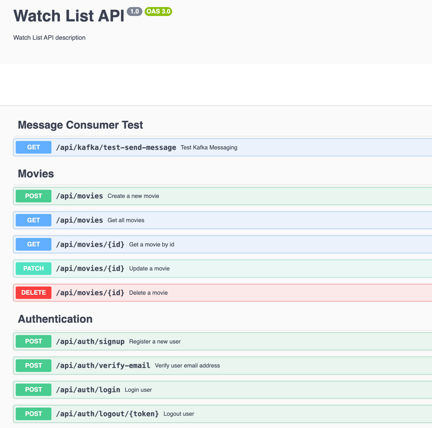

# Watch List Web App

## Setting Up the Development Environment

Grant execution permission to the script:
```bash
chmod +x ./dev.sh
```

Start the development environment by running the script:
```bash
./dev.sh start 
```

This will initialize the following services:
- PostgreSQL
- Redis
- Apache Kafka

### Database Integration
Before starting the server, integrate the database by running:
```bash
cd server-side && npm run database-integrate
```

### Running the Server
```bash
cd server-side && npm run start
```

### Running the UI
```bash
cd server-ui && npm run dev
```

### Access Swagger UI
The Swagger UI can be accessed at:
- [http://localhost:3000/api](http://localhost:3000/api)

The Swagger UI will look like this:


